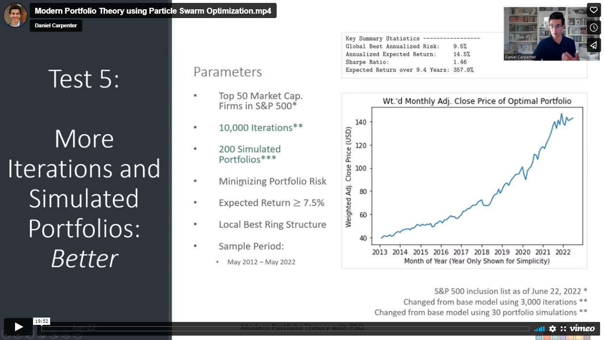

 

# Modern Portfolio Theory using Particle Swarm Optimization
> Daniel Carpenter  
> June 2022
   
This project outlines how Modern Portfolio Theory can be implemented using
notable financial engineering techniques. The generated algorithm
discussed within this project combines a dynamic implementation of Modern
Portfolio Theory with a robust metaheuristic solver to find the globally
minimum risk portfolio, given the desired set of stocks and sample date
range. Specifically, the metaheuristic called “Particle Swarm
Optimization” intends to overcome issues with local optima in non-linear
modeling. The model delivers the optimal weights to invest in a certain
set of stocks, defined by the user of the tool. Additionally, the model
displays key summary statistics like the risk and expected return of the
portfolio.

 

# Quick Links
* [Example of Optimization](Stock_Portfolio_Optimizer_Code/README.md)
* [Presentation of Report (Slides)](Detailed%20Analysis/Detailed%20Analysis.pdf)
* [Detailed Analysis and Report](Presentation%20Slides%20(.pdf).pdf)